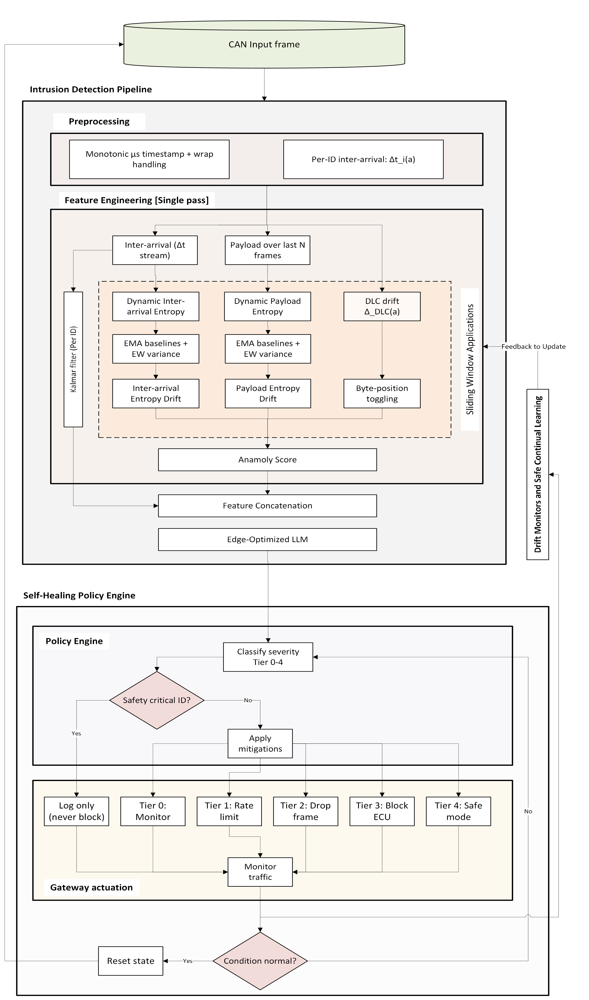

# SHIELD-CAN: A Self-Healing Edge-AI Intrusion Detection System for Automotive CAN Gateways


Modern vehicles rely on many interconnected Electronic Control Units (ECUs) that communicate over the legacy Controller Area Network (CAN) bus, which is still vulnerable to cyber-physical attacks that can impact both safety and availability. Deploying machine learning-based intrusion detection systems (IDS) directly on in-vehicle gateways can improve protection, but also introduces tight constraints on latency, memory footprint, and safe interaction with critical workloads. It also requires that detection outputs be translated into clear, analysable mitigation actions.

**SHIELD-CAN** is a self-healing edge-AI intrusion detection and response system designed specifically for automotive CAN gateways and dependability:

- Combines a streaming, protocol-agnostic feature pipeline with a compact encoder-only Transformer operating on short windows of traffic statistics.
- Supports `O(1)` per-frame feature updates and sub-millisecond inference on embedded ARM hardware using 8-bit quantisation.
- Uses a deterministic, multi-tier self-healing policy that maps anomaly scores and class predictions into:
  - rate limiting,
  - selective dropping, and
  - ECU-level quarantine,
  while enforcing safety invariants that prevent interference with safety-critical messages and bound degraded modes.


<p align="center">
  
</p>


---

## Key Features

- **Streaming feature extraction**
  - Protocol-agnostic, operates directly on raw CAN frames
  - O(1) state per CAN ID; constant-time per-frame updates
  - Dual entropy measures (timing & payload), Kalman-based timing analysis, DLC drift, byte-position toggling

- **Edge-optimised Transformer model**
  - Encoder-only Transformer over short windows of features
  - Single STAT token for window-level classification
  - Static shapes and compact architecture suitable for quantisation and edge deployment

- **Deterministic self-healing policy**
  - Multi-tier response: logging → shaping (rate limiting) → dropping → ECU quarantine → (optional) safe-mode
  - Enforces safety invariants (e.g. never drop safety-critical IDs, bounded degraded modes)

- **Gateway-oriented design**
  - Streaming feature extractor + model + policy + gateway simulator
  - Designed to sit at an in-vehicle gateway between CAN segments

- **Research-friendly**
  - Works on standard CAN IDS datasets (e.g., Car-Hacking, IVN-IDS)
  - Training script, dataset loader, and example CSV schema included
 
## Datasets

You can download the example CAN intrusion datasets used with this code from:

- [Car Hacking Dataset](https://www.kaggle.com/datasets/pranavjha24/car-hacking-dataset)
- [IVN-IDS Dataset](https://www.kaggle.com/datasets/daksh0511/ivn-ids/code)

---

## Repository Structure

```text
.
├── LICENSE
├── README.md
├── requirements.txt
├── setup.py
├── .gitignore
├── examples/
│   └── sample_can_log.csv
├── train.py
└── shield_can/
    ├── __init__.py
    ├── config.py
    ├── dataset.py
    ├── features.py
    ├── gateway_sim.py
    ├── model.py
    ├── policy.py
    └── utils.py
```

## Core Components

- `config.py` – dataclasses for feature, model, training, policy, and safety configs  
- `features.py` – streaming feature extractor (per-frame → 9-D feature vector)  
- `model.py` – encoder-only Transformer (`EdgeTransformer`)  
- `policy.py` – multi-tier self-healing policy with safety-aware actions  
- `dataset.py` – CAN log → feature windows for training  
- `gateway_sim.py` – example gateway loop using feature extractor, model, and policy  
- `train.py` – training script (PyTorch) for the Transformer  

---

## Installation

### 1. Clone the repository

```bash
git clone https://github.com/<your-username>/shield-can.git
cd shield-can
```

### 2. Create a virtual environment (recommended)
```bash
python -m venv .venv
source .venv/bin/activate      # On Windows: .venv\Scripts\activate
```
### 3. Install dependencies

Using `requirements.txt`:
```bash
pip install --upgrade pip
pip install -r requirements.txt
```

Or install as an editable package:

```bash
pip install -e .
```

**Python version**: 3.9+ is recommended.

## CAN Log Format

The implementation assumes CAN logs in a CSV format similar to:

```bash
timestamp,id,dlc,data0,data1,data2,data3,data4,data5,data6,data7,label
0.000000,0x130,8,0,0,0,0,0,0,0,0,Normal
0.010000,0x130,8,0,0,16,0,0,0,0,0,Normal
0.020000,0x130,8,0,0,32,0,0,0,0,0,Normal
0.030000,0x1A0,8,10,20,30,40,50,60,70,80,DoS
```

**Expected columns**:

  - `timestamp` – float (seconds). If in ms, it will be converted internally.
  - `id` – CAN ID as integer or hex string (e.g. 0x130).
  - `dlc` – data length code (0–8 for classical CAN).
  - `data0 .. data7` – payload bytes (0–255); only the first dlc are used.
  - `label` – class label (string or int). Example label mapping (default in train.py):

```bash
{
    "Normal": 0,
    "DoS": 1,
    "Fuzzy": 2,
    "Malfunction": 3,
    "Spoof": 4,
}
```

You can adjust the label mapping in `train.py` to match your dataset.

## Training the Transformer

The main training entrypoint is `train.py`.

```bash
Basic usage
python train.py \
  --train_csv data/car_hacking_train.csv \
  --val_csv data/car_hacking_val.csv \
  --out_dir runs/shield_can \
  --epochs 30 \
  --batch_size 128 \
  --lr 3e-4 \
  --device cuda
```


## Configuration

Key configuration classes are defined in shield_can/config.py:

**FeatureConfig**
  - Timing histogram size
  - Entropy half-lives
  - Kalman parameters
  - Toggling half-life, etc.

**ModelConfig**
  - Feature dimensionality
  - Transformer depth
  - Number of heads
  - Window size
  - Number of classes
  - Dropout

**TrainingConfig**
  - Batch size
  - Number of epochs
  - Learning rate
  - Device

**PolicyConfig**
  - Thresholds and time constants for tiered responses
  - Shaping (rate limiting)
  - Dropping
  - ECU quarantine
  - Safe mode

**SafetyConfig**
  - `safety_critical_ids`: CAN IDs that must never be dropped.
  - `id_to_ecu`: mapping from CAN IDs to ECU names used by the self-healing policy.


## Citing

If you use SHIELD-CAN framework, please cite the corresponding work:

```bash
@article{kumar2025shieldcan,
  title   = {SHIELD-CAN: A Self-Healing Edge-AI Intrusion Detection System for Automotive CAN Gateways},
  author  = {Mahender Kumar and Gregory Epiphaniou and Carsten Maple},
  journal = {Preprint},
  year    = {2025}
}
```
## Contributor 
  - [Mahender Kumar](https://scholar.google.com/citations?user=Ppmct6EAAAAJ&hl=en)
  - [Gregory Epiphaniou](https://warwick.ac.uk/fac/sci/wmg/about/our-people/profile/?wmgid=2175)
  - [Carsten Maple](https://warwick.ac.uk/fac/sci/wmg/about/our-people/profile/?wmgid=1102)
